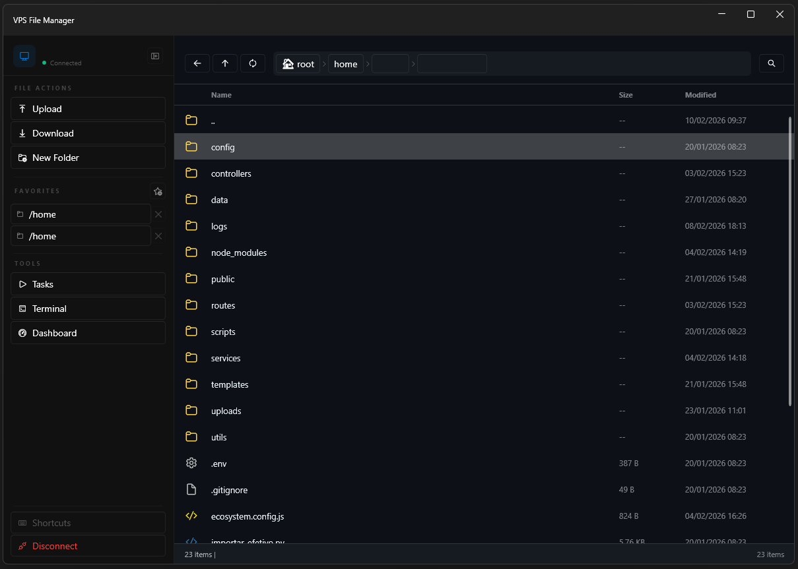
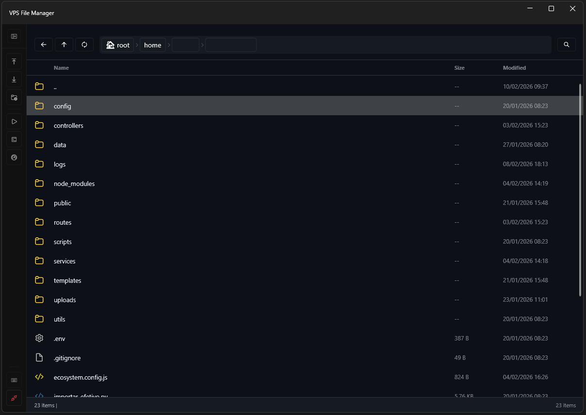
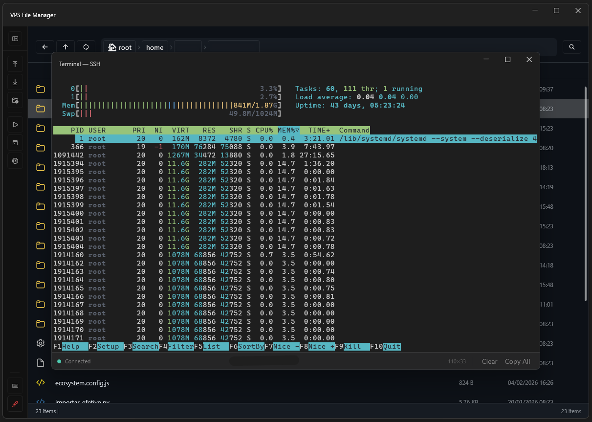
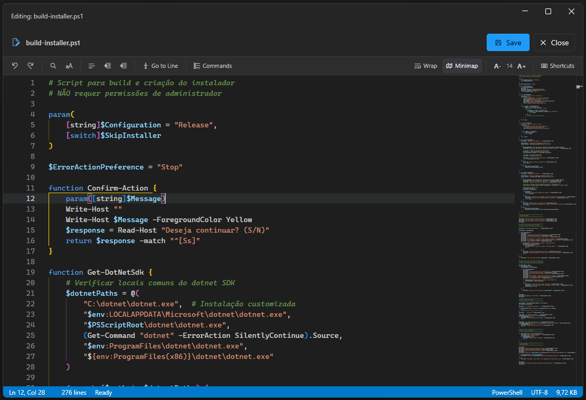
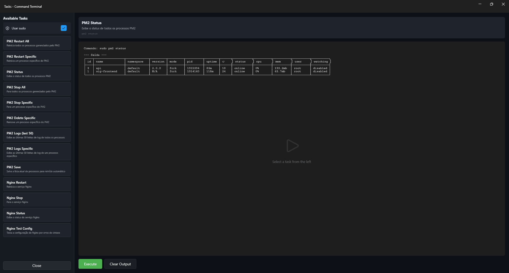

<p align="center">
  
</p>

<h1 align="center">VPS File Manager</h1>

<p align="center">
  <strong>Gerenciador de arquivos para VPS via SSH/SFTP com terminal embutido</strong>
</p>

<p align="center">
  <em>Integração completa: gerenciamento de arquivos, terminal e editor em um único aplicativo</em>
</p>

<p align="center">
  <!-- Tech Stack Badges -->
  
  
  
  
  
</p>

<p align="center">
  <!-- Stats & Status Badges (com cache para evitar rate limiting) -->
  
  
  
</p>

---

<p align="center">
  
  
</p>

<p align="center">
  <em>Sidebar expandida com seções organizadas &bull; Sidebar colapsada em icon strip</em>
</p>

---

##  Início Rápido

```bash
# 1. Clone o repositório
git clone https://github.com/MatheusANBS/VPS-File-Mannager.git
cd VPS-File-Mannager

# 2. Execute o instalador
.\build.bat

# 3. Pronto! O app será aberto automaticamente
```

**Primeira conexão:**
1. Clique em "Nova Conexão"
2. Preencha host, usuário e senha
3. Conectar e começar a usar!

---

##  Por que VPS File Manager?

|  **Antes** |  **Agora** |
|---|---|
|  **WinSCP** → Upload/Download |  **1 aplicativo integrado** |
|  **PuTTY** → Terminal |  **Workflow contínuo** |
|  **Notepad++** → Editar configs |  **3x mais produtivo** |
|  **Alt+Tab** → Trocar entre 3 apps |  **Interface moderna** |
|  Tempo perdido trocando contexto |  **Mais seguro (DPAPI)** |

### O Problema que Resolvemos

Gerenciar servidores VPS exige múltiplas ferramentas desconectadas. Você perde tempo trocando entre apps (WinSCP, PuTTY, editor), re-autenticando em cada ferramenta e perdendo o contexto de onde estava.

**VPS File Manager unifica tudo**, mantendo você no fluxo.

---

##  Comparação com Alternativas

| Feature | WinSCP | FileZilla | PuTTY + WinSCP | **VPS File Manager** |
|---------|--------|-----------|----------------|---------------------|
|  SFTP Browser |  |  |  |  |
|  Upload/Download |  |  |  |  |
|  Terminal SSH |  |  |  (separado) |  **integrado** |
|  Editor de Código |  básico |  |  |  **Monaco (VS Code)** |
|  UI Moderna (Fluent) |  |  |  |  |
|  Tasks/Comandos |  |  |  |  |
|  PM2 Integration |  |  |  |  |
|  Dashboard (CPU/RAM/Disk) |  |  |  |  **real-time** |
|  Favoritos |  |  |  |  **por conexão** |
|  Context Switching | Alto | Alto | Muito Alto | **Zero** |
|  Segurança de Senhas |  |  |  |  **DPAPI** |

---

##  Para Quem é Este Projeto?

<table>
<tr>
<td width="50%">

###  Desenvolvedores Web
- Deploy rápido de aplicações Node/PHP
- Debug direto no servidor
- Editar configs sem baixar/subir
- Restart de serviços (nginx, pm2)

</td>
<td width="50%">

###  DevOps / SysAdmins
- Gerenciar múltiplos servidores
- Executar tasks repetitivas
- **Dashboard integrado** (CPU, RAM, Disk, Network)
- Scripts de manutenção

</td>
</tr>
<tr>
<td>

###  Estudantes
- Aprender Linux sem VM local
- Praticar comandos SSH
- Ambiente real de desenvolvimento
- Interface amigável para iniciantes

</td>
<td>

###  Equipes
- Acesso padronizado a servidores
- Compartilhar configs/tasks
- Sem necessidade de admin
- Onboarding mais rápido

</td>
</tr>
</table>

---

##  Funcionalidades em Destaque

###  Gerenciador de Arquivos
- Upload/Download com progresso
- Drag & Drop do Windows
- Navegação com histórico (voltar/avançar)
- Favoritos por conexão
- Busca recursiva com glob patterns
- Multi-seleção e operações em lote
- **Sidebar colapsável** com seções organizadas (File Actions, Favorites, Tools)
- Detecção de **alterações não salvas** com diálogo de confirmação

###  Terminal Embutido (TTY Real)
<p align="center">
  
</p>

- Emulador VT100/xterm-256color completo
- Roda `htop`, `vim`, `nano`, `mc` perfeitamente
- 256 cores + True Color (RGB)
- Scrollback de 10.000 linhas
- Copiar/colar funciona de verdade

###  Editor de Código (Monaco — Engine do VS Code)
<p align="center">
  
</p>

- **Monaco Editor** embarcado (mesmo engine do VS Code)
- Syntax highlighting (60+ linguagens)
- IntelliSense, autocomplete e code folding
- Minimap, word wrap e tamanho de fonte ajustável
- Toolbar visual com todos os comandos acessíveis
- Command Palette (F1) e Go to Line (Ctrl+G)
- Find & Replace com regex
- Barra de status com posição do cursor, seleção, linguagem e encoding
- Salva direto no servidor (Ctrl+S)
- Detecta alterações não salvas
- Suporte a `.env`, `.json`, `.yaml`, `.py`, `.js`, `.ts`, `.rs`, `.go`...

###  Dashboard de Monitoramento

<p align="center">
  
</p>

- **Métricas em tempo real** do servidor via SSH (leitura de /proc)
- **CPU Usage** com sparkline de histórico e percentual em tempo real
- **Memory Usage** com sparkline de histórico (usado/total)
- **Disk Usage** com gráfico donut visual (espaço usado/livre)
- **Network Interfaces** com IP, tráfego TX/RX e velocidade
- **Uptime** do servidor com ícone de heartbeat
- **System Info** — hostname, OS, kernel, CPUs, load average
- **Top Processes** — tabelas de processos por CPU e por Memória
- Refresh automático configurável (padrão: 3s)
- Color-coding por threshold (verde → amarelo → vermelho)

###  Automação de Tasks
<p align="center">
  
</p>

- **13 comandos pré-configurados** prontos para uso
- **Toggle sudo** — ative/desative sudo para todos os comandos (ideal para servidores root)
- Suporte a `sudo` com prompt de senha seguro
- Seleção dinâmica de processos (carrega lista via SSH)

**PM2:**
| Comando | Descrição |
|---------|----------|
| PM2 Restart All | Reinicia todos os processos |
| PM2 Restart Specific | Reinicia um processo específico |
| PM2 Stop All | Para todos os processos |
| PM2 Stop Specific | Para um processo específico |
| PM2 Delete Specific | Remove um processo do PM2 |
| PM2 Status | Exibe status de todos os processos |
| PM2 Logs | Últimas 50 linhas de log (todos) |
| PM2 Logs Specific | Logs de um processo específico |
| PM2 Save | Salva lista para auto-restart |

**Nginx:**
| Comando | Descrição |
|---------|----------|
| Nginx Restart | Reinicia o serviço |
| Nginx Stop | Para o serviço |
| Nginx Status | Exibe status do serviço |
| Nginx Test Config | Testa configuração por erros |

---

##  Atalhos de Teclado

<details>
<summary><strong>Clique para ver todos os atalhos</strong></summary>

| Atalho | Ação | Contexto |
|--------|------|----------|
| `Ctrl+R` | Atualizar | Qualquer lugar |
| `Ctrl+U` | Upload | File Manager |
| `Ctrl+D` | Download | File Manager |
| `Ctrl+N` | Nova pasta | File Manager |
| `Delete` | Deletar | File Manager |
| `F2` | Renomear | File Manager |
| `Ctrl+H` | Ir para root (`/`) | File Manager |
| `Backspace` | Subir diretório | File Manager |
| `Alt+←` | Voltar | Navegação |
| `Alt+→` | Avançar | Navegação |
| `Ctrl+F` | Busca avançada | File Manager |
| `Ctrl+A` | Selecionar tudo | File Manager |
| `Ctrl+L` | Editar path | File Manager |
| `Ctrl+S` | Salvar | Editor |
| `Ctrl+F` | Buscar | Editor |
| `Ctrl+H` | Buscar & Substituir | Editor |
| `Ctrl+G` | Ir para Linha | Editor |
| `Ctrl+Z` | Desfazer | Editor |
| `Ctrl+Y` | Refazer | Editor |
| `Ctrl+W` | Fechar editor | Editor |
| `Shift+Alt+F` | Formatar documento | Editor |
| `Alt+Z` | Toggle Word Wrap | Editor |
| `F1` | Command Palette | Editor |
| `Ctrl+C` | Interromper (SIGINT) | Terminal |
| `Ctrl+D` | EOF/Logout | Terminal |

</details>

---

##  Stack Tecnológica

```
┌─────────────────────────────────────────────────────────────┐
│                      VPS File Manager                        │
├─────────────────────────────────────────────────────────────┤
│  UI Layer                                                    │
│  ┌─────────────┐  ┌─────────────┐  ┌─────────────────────┐  │
│  │  WPF-UI 3.0 │  │Monaco Editor│  │ Custom Terminal     │  │
│  │  (Fluent)   │  │ (WebView2)  │  │ Control (xterm-256) │  │
│  └─────────────┘  └─────────────┘  └─────────────────────┘  │
│  ┌─────────────┐  ┌─────────────┐  ┌─────────────────────┐  │
│  │  Dashboard  │  │  Sparkline  │  │ Donut Chart         │  │
│  │  (Metrics)  │  │  Control    │  │ (Disk Usage)        │  │
│  └─────────────┘  └─────────────┘  └─────────────────────┘  │
├─────────────────────────────────────────────────────────────┤
│  Logic Layer (MVVM)                                          │
│  ┌─────────────────────────────────────────────────────────┐│
│  │          CommunityToolkit.Mvvm 8.2.2                    ││
│  │     (ObservableObject, RelayCommand, etc.)              ││
│  └─────────────────────────────────────────────────────────┘│
├─────────────────────────────────────────────────────────────┤
│  Services Layer                                              │
│  ┌─────────────┐  ┌─────────────┐  ┌─────────────────────┐  │
│  │  SSH.NET    │  │ DPAPI       │  │ VirtualTerminal     │  │
│  │  (SFTP/SSH) │  │ (Crypto)    │  │ (xterm emulator)    │  │
│  └─────────────┘  └─────────────┘  └─────────────────────┘  │
├─────────────────────────────────────────────────────────────┤
│  .NET 8.0                                                    │
└─────────────────────────────────────────────────────────────┘
```

---

##  Segurança

<table>
<tr>
<td width="33%">

### Criptografia de Credenciais
-  Usa **Windows DPAPI**
-  Senhas nunca em texto plano
-  Proteção por usuário Windows
-  Limpeza automática de memória

</td>
<td width="33%">

### Autenticação
-  Senha tradicional
-  Chave privada (PEM/PPK)
-  Suporte a passphrase
-  Múltiplos métodos por conexão

</td>
<td width="34%">

### Privacidade
-  Zero telemetria
-  Zero tracking
-  Dados locais apenas
-  Open source auditável

</td>
</tr>
</table>

**Política de Segurança:** Encontrou uma vulnerabilidade? Por favor, veja [SECURITY.md](SECURITY.md).

---

##  Comunidade & Contribuição

<p align="center">
  <a href="https://github.com/MatheusANBS/VPS-File-Mannager/discussions">
    
  </a>
  <a href="https://github.com/MatheusANBS/VPS-File-Mannager/graphs/contributors">
    
  </a>
</p>

Contribuições são bem-vindas!
1. Fork o projeto
2. Crie uma branch (`git checkout -b feature/MinhaFeature`)
3. Commit suas mudanças (`git commit -m 'Add: Minha nova feature'`)
4. Push para a branch (`git push origin feature/MinhaFeature`)
5. Abra um Pull Request

> Leia o **[CONTRIBUTING.md](CONTRIBUTING.md)** para guias detalhados.

---

##  Pronto para Começar?

<p align="center">
  <a href="https://github.com/MatheusANBS/VPS-File-Mannager/releases/latest">
    
  </a>
  <a href="https://github.com/MatheusANBS/VPS-File-Mannager/wiki">
    
  </a>
  <a href="https://github.com/MatheusANBS/VPS-File-Mannager/issues">
    
  </a>
</p>

<p align="center">
  <strong>Se este projeto economizou seu tempo, considere deixar uma !</strong>
</p>

---

<p align="center">
  <sub>VPS File Manager © 2024-2026 - Licença MIT</sub>
</p>
